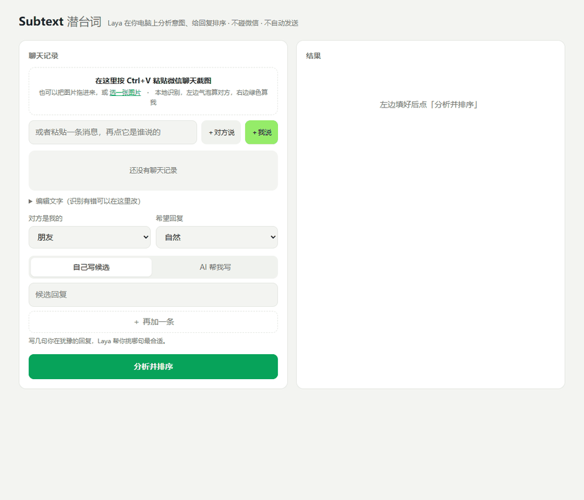
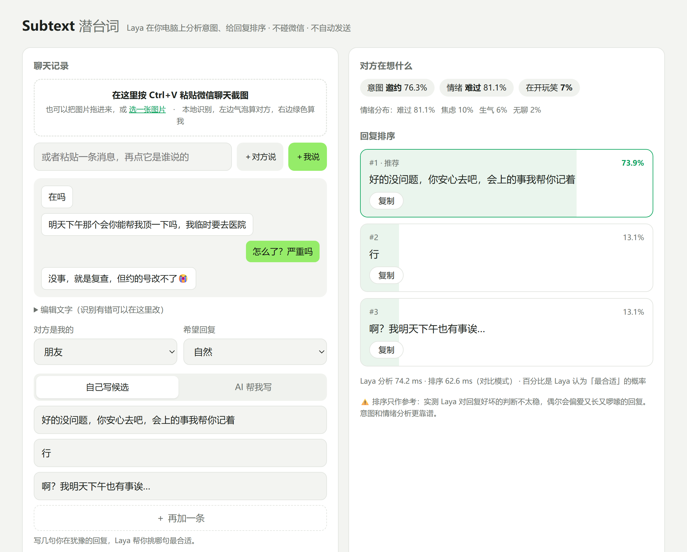
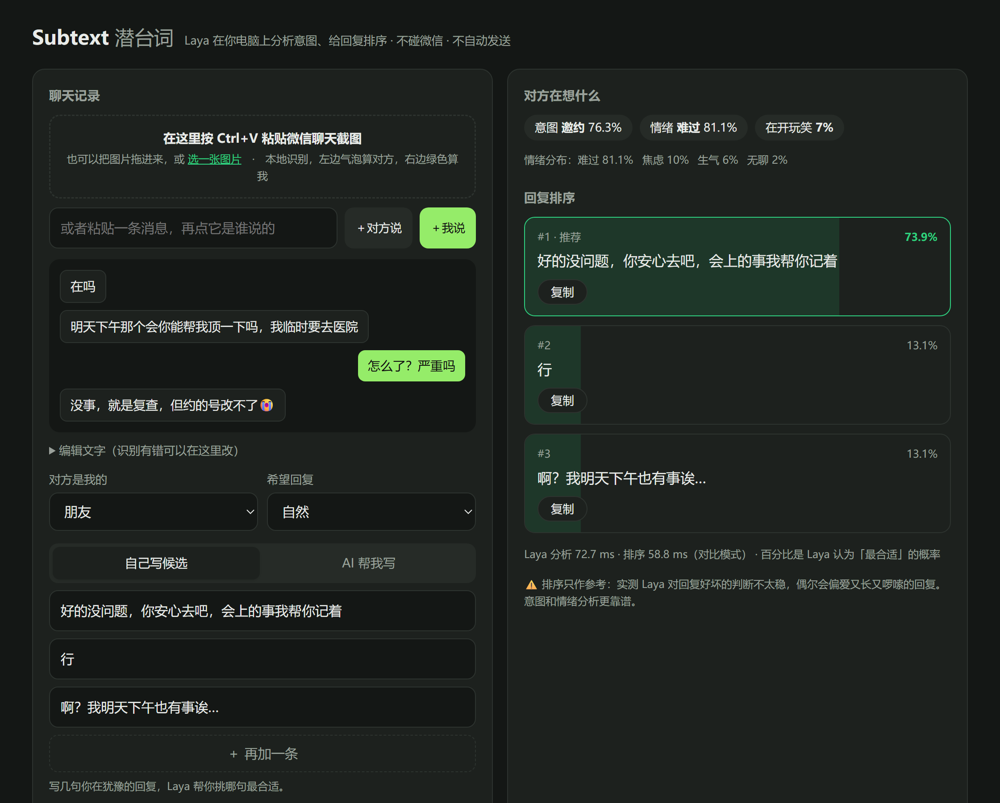

# Subtext

[中文](README.md) | **English**

**Read between the lines, then decide how to reply.**

Subtext is a chat reply assistant that runs entirely on your own computer. Paste a screenshot of a WeChat conversation and it tells you what the other person wants, how they feel, and whether they're joking, then ranks the replies you're considering.

- 🔒 **Local-first**: screenshot OCR and analysis both run on your machine. No network access by default
- ⚡ **Fast**: built on the open-weights decision model [Laya](https://huggingface.co/convaiinnovations/laya). About 50 ms per analysis on an RTX 4060 laptop GPU
- 🙅 **Hands off your messenger**: never reads WeChat's database, never injects code, never sends anything. It only sees screenshots you paste in
- ✍️ **Optional AI drafting**: plug in DeepSeek or any OpenAI-compatible API to get 3 drafted replies, which Laya then ranks

> The interface is currently in Chinese, and the analysis prompts are tuned for Chinese conversations. Laya itself supports 100+ languages, and PRs for i18n are welcome.



<details><summary>Screenshots (light / dark)</summary>





</details>

## Features

| Feature | What it does |
|---|---|
| Screenshot import | Press `Ctrl+V` on the page to paste a chat screenshot. Local OCR reads the text and tells "them" from "me" by bubble color. Works with phone and desktop screenshots, light and dark, and skips text inside images and stickers |
| Intent | small talk, question, favor, invitation, request/task, venting, sharing, teasing, wrapping up |
| Emotion | happy, calm, anxious, angry, sad, bored, with a probability distribution |
| Joke detection | Is the other person joking? |
| Reply ranking | Scores your candidate replies (or AI-drafted ones) and shows the probability that each is the best fit |

## How it works

```
screenshot ──RapidOCR──▶ text + bubble position/color ──▶ "them: …" / "me: …"
                                                               │
             Laya (single forward pass, non-generative) ◀──────┘
               ├─ intent / emotion / joking: choice & yes-no questions
               └─ reply ranking: candidates become the options of one choice question
```

Laya is not a chatbot. It reads the conversation once and outputs a calibrated probability for each option, with no text generation. That makes it fast and cheap, and good at classification. It is weaker at nuanced "is this a good reply" judgments (see Limitations).

The whole app is two files: `server.py` (a standard-library HTTP server plus model calls) and `index.html` (the UI).

## Install

You need [Anaconda / Miniconda](https://www.anaconda.com/download). An NVIDIA GPU is recommended. On CPU it still works, at about 0.2–0.5 s per analysis.

**Windows**

1. Download this repo (**Code → Download ZIP**, or `git clone`)
2. Double-click **`setup.bat`**. It creates a `subtext` conda env and installs dependencies (~3 GB, mostly PyTorch)
3. Double-click **`start.bat`**. The first run downloads the Laya model (~650 MB). After that, startup takes about 30–40 s, and your browser opens http://127.0.0.1:7860

**macOS / Linux**

```bash
conda create -n subtext python=3.11 -y
conda activate subtext
pip install torch            # pick the right CUDA build at https://pytorch.org
pip install -r requirements.txt
python server.py
```

Open http://127.0.0.1:7860/#demo to see a sample run right away.

## Optional: AI-drafted replies

Set an API key and restart:

```bash
# Windows (PowerShell)
setx DEEPSEEK_API_KEY "your-key"
# macOS / Linux
export DEEPSEEK_API_KEY="your-key"
```

To use any other OpenAI-compatible endpoint (OpenRouter, Ollama, …), set `LLM_BASE_URL`, `LLM_MODEL` and `LLM_API_KEY`.

> ⚠️ When drafting is on, the recent conversation, including the other person's messages, is sent to the provider you configured.

## Optional: make the drafts sound like you

Show the model how you actually text, and the drafts match your voice. No training involved.

1. Put your own chat screenshots in a folder, e.g. `screenshots/` (a few dozen is enough)
2. Build the corpus — it keeps **only your own messages** plus their context:

   ```bash
   python build_corpus.py screenshots
   ```

3. Restart Subtext and tick **像我说话** ("sound like me") in the AI drafting tab

Subtext summarizes your habits (message length, punctuation and emoji use, common openers) and retrieves the most similar past exchanges, then asks the model to imitate them.

Same prompt, before and after (a friend asking whether your paper is done):

| Off | On (169 of my real replies) |
|---|---|
| 哎呀正愁这事呢，你写多少了？ | 就是有点赶 |
| 快了快了，你呢？别告诉我你也没写完 | 我想再改改 |

`my_style.jsonl` and the adoption log `adopted.jsonl` are gitignored and never leave your machine.

The corpus grows as you use it. Every copy is logged to `adopted.jsonl` (training data for fine-tuning the ranker later), and `my_style.jsonl` picks up two kinds of new lines: every "me" message in a screenshot you paste (collected when you hit analyze, so you can fix mislabeled bubbles first), and, in the "write my own candidates" mode, the line you copy. Duplicates are skipped. Drafts written by the LLM are never fed back into the style corpus — that would drift the imitation away from your real voice.

## Limitations

- ✅ **Emotion and joke detection**: right most of the time in our tests
- ⚠️ **Intent**: mostly right, with clear misses. For example, "can you cover this meeting for me" gets labeled as an invitation (visible in the collapsed screenshots above)
- ⚠️ **Reply ranking**: treat it as a hint. Laya is a classifier, and it sometimes prefers long, rambling replies, and rewording a candidate can flip the ranking
- ⚠️ **OCR**: "me" is detected by WeChat's green bubble; phone and desktop screenshots both work. In group chats, sender nicknames may show up as a message, so delete them by hand
- Laya was released in September 2026. Its behavior and API may still change

Bug reports with (redacted) example screenshots are very welcome in Issues.

## Disclaimer

- Not affiliated with WeChat/Tencent, Convai Innovations, or DeepSeek
- Only processes screenshots or text you provide. It never accesses accounts or message databases and never sends messages
- Respect the privacy of the people you chat with. Do not use it for harassment, fraud, or anything illegal
- Model output is only a suggestion. What you send is your call

## Credits

- [Laya](https://huggingface.co/convaiinnovations/laya) by Convai Innovations (Apache 2.0)
- [RapidOCR](https://github.com/RapidAI/RapidOCR) (Apache 2.0)

## License

[MIT](LICENSE)
